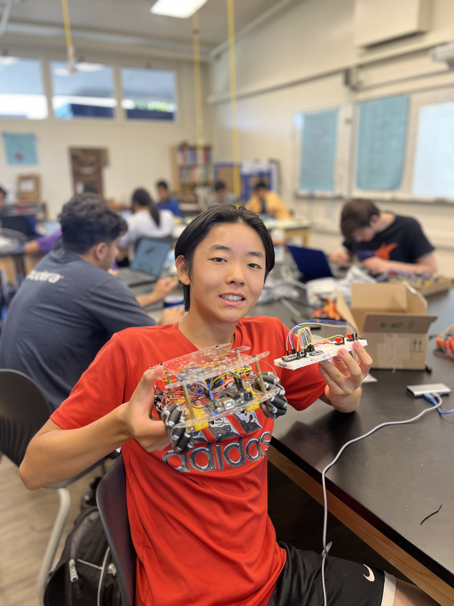
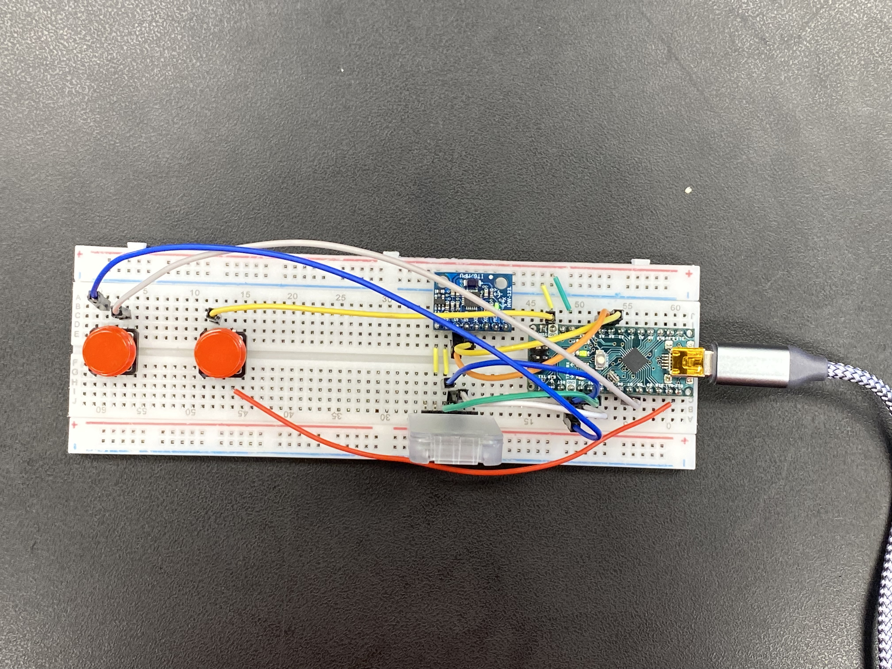
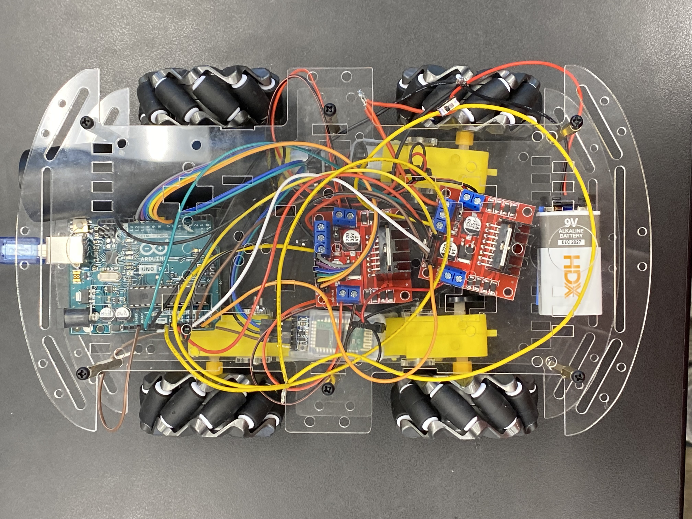
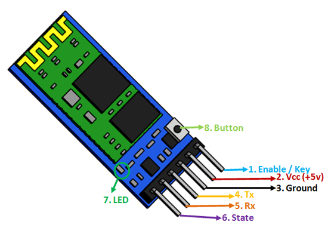

# 🤖 Gesture Controlled Robot 🤖
My project is a robot controlled by gestures from a bluetooth-connected gauntlet, that moves based on specific movements and directions, such as rotation and forward and backwards movement. One challenge I had was soldering the the pins so that some of them were connected (like the USB port) and some of them were seperate (like the pins on the LED display boards). My biggest takeaway from the project was to solder more carefully and precisely when the pins are pushed fully through, and to bend the pins to keep the pins fully pushed through.


| **Engineer** | **School** | **Area of Interest** | **Grade** |
|:--:|:--:|:--:|:--:|
| Daniel J. | Carlmont High School | Mechanical Engineering | Incoming Junior

<p align="center">
  
</p> 

# Modded Milestone: 7/05/24

<iframe width="560" height="315" src="https://www.youtube.com/embed/h9s9ytI3gEE?si=vlpUg0wPEjz6c3e7" title="YouTube video player" frameborder="0" allow="accelerometer; autoplay; clipboard-write; encrypted-media; gyroscope; picture-in-picture; web-share" referrerpolicy="strict-origin-when-cross-origin" allowfullscreen style = "border: 3px solid #c3ff00;"></iframe>

For my modded milestone, I replaced the wheels with mecanum wheels, which have 8 wheels within each individual wheels, expanding my effective range of actions. To compensate for the expanded functinoality of the mecanum wheels, I added another L298 motor controller, allowing me to control each motor's direction and power individually. This allows the robot to move in all 4 four diagonal movements without needing to move. Most unique of all (to me), mecanum wheels allow the robot to move in the left and right directions perpendicular to the direction of the motors, once again without the need to rotate the motor. Lastly, I added more code depending on the magnitude of tilt in the motor to output different actions. For example, in the case of forward and backward movements, the robot will move at an increased speed with a higher degree of tilt. Regarding the left and right controls, a slight turn in both directions results in stationary left and right rotations. Contrarily, a stronger left and right controls results in a forward and left rotation as well as forward and right rotation respectively. I also expanded the breadboard to include two buttons that allows for the previously mentioned perpendicular movement to the left and right. 

<p align="center">
  
  <br>
  <small>Figure 1: A complex, completed breadboard with two supplementary buttons with the features of moving left and right (the left button allows leftward movement, and the same is applied to the right button).</small>
</p>

<p align="center">
  
  <br>
  <small>Figure 2: My completed robot: two L298 motor controllers, an Arduino UNO, four DC motors, an HC-05 bluetooth module, and a power source (includes variability). The motor controller closer to the Arduino UNO (the green rectangle) controls the front two motors, and the motor controller further from the UNO controls the back two motors. .</small>
</p>


# Final Milestone: 6/24/24

<iframe width="560" height="315" src="https://www.youtube.com/embed/4He3Q5KjJpA?si=w6uD7RK8z6YsOl8N" title="YouTube video player" frameborder="0" allow="accelerometer; autoplay; clipboard-write; encrypted-media; gyroscope; picture-in-picture; web-share" referrerpolicy="strict-origin-when-cross-origin" allowfullscreen style="border: 3px solid #c3ff00;"></iframe>


For my third milestone, I attached the top frame to the body of the robot, added a switch to the body, fixed the power disrepencies in the wheels, and started the concept for my glove. My biggest challenge at BSE was resolving an issue regarding an inconsistency in power: by focusing on specific areas that could be problematic, I removed the possibility for error in the motor and energy by changing the battery and constantly checking the voltage. Another issue was pairng to Arduinos together via HC-05 bluetooth modules, and we fixed that by troubleshooting very rigorously. Key topics I have learned in this process include soldering, isolating issues in an engineering process, and how voltage and current function using Ohm's Law. I hope to learn how to analyze code and interpret it into hardware-based actions. 


<p align="center">
  
  <br>
  <small>Figure 3: An image of the basic, completed breadboard that communicates basic movemements to the slave bluetooth module.</small>
</p>


# Second Milestone: 6/20/24


<iframe width="560" height="315" src="https://www.youtube.com/embed/jv5230nLu1c?si=5IgLsPRPFiSzR8Pm" title="YouTube video player" frameborder="0" allow="accelerometer; autoplay; clipboard-write; encrypted-media; gyroscope; picture-in-picture; web-share" referrerpolicy="strict-origin-when-cross-origin" allowfullscreen style="border: 3px solid #c3ff00;"></iframe>


For my second milestone, I implemented a bluetooth module that is paired with the main body to take inputs and translate them into motor actions. The bluetooth takes inputs from the accelerometer and gyroscope, being processed by the Arduino Nano R3 on the master module. The accelerometer and gyroscope measures "AcX"(yaw), "AxY"(pitch), and "AcZ"(roll). Each output of the master bluetooth module is read and checked with a series of conditions in which it communicates with the slave bluetooth module via sending letters. Then, the information is transferred (via Bluetooth) into the "slave" bluetooth module in order to be processed by an Arduino UNO and then outputted by an L298 motor controller with DC motors. What has surprised me the most was comprehensibility of the input process on the hand-mounted bluetooth module, where the data is printed in the Arduino IDE module. A previous challenge I overcame was the bluetooth connection process: it was surprisingly complex and took a long time to troubleshoot through. Before completing the final milestone, I will fix the consistency of power outage within the motors, as well as fix the battery output so that I do not have to use the power of my computer to power the motors. 

<p align="center">
  
  <br>
  <small>Figure 4: Diagram of an HC-05 Bluetooth Module, and its pins. Pin #1 allows the user to switch between data modes of the blutooth module, including data mode (LOW) and AT mode (HIGH). Pin #2 powers the bluetooth module, connecting to a +5V power supply. Pin #3 is the ground pin of the module, which connects it to the system's ground. Pin #4, TX (also known as transmitter), transmits serial data given out by the whole bluetooth module. Pin #5, RX (also known as receiver), receives serial data broadcasted via Bluetooth with this pin. Pin #6 , not used by my robot, connects the LED to the bluetooth module. Pin #7, the LED, indicates, through two disctint, recognizable series of blinking, conveys the mode of the bluetooth module. Pin #8, the button, controls the key / enable pin to toggle between data and AT mode. (credit to "components 101") </small>
</p>

<h2 id="subtitle">Pairing bluetooth modules</h2>

In order to pair the two bluetooth modules, I set both modules to "AT mode", a configuration built into the bluetooth modules allowing me to assign the device roles to master and slave respectively. Then, a set of commands were sent to both bluetooth modules with code that reads commands of the serial monitor and executes the corresponding actions. The same code is used for both the master and slave bluetooth module, although different commands are used to differentiate between the two.

<h2 id="subtitle">Pairing code (for both master and slave)</h2>

```none

#include <SoftwareSerial.h>

SoftwareSerial Bluetooth(3,2);


void setup() {
  Serial.begin(9600);
  Bluetooth.begin(38400);

}

void loop() {
  if (Bluetooth.available()){
    Serial.write(Bluetooth.read());
  }
  if (Serial.available()){
    Bluetooth.write(Serial.read());
  }
}


```

Upon uploading the above code to both bluetooth modules, AT commands would be sent in order to associate one specific bluetooth module (the one on the breadboard in this case) as the master, and the other (the one on the robot) as a slave. 

<h2 id="subtitle">AT commands for master bluetooth module</h2>

```none

AT | OK | Check if the HC-05 is in AT Command mode

AT+ROLE=0 | OK | This makes the HC=05 a Slave

AT+ADDR? | <addr>, OK | Displays the HC-05's address

``` 

<h2 id="subtitle">AT commands for slave bluetooth module</h2>

```none

AT | OK | Check if the HC-05 is in AT Command mode

AT+ROLE=1 | OK | This makes the HC-05 a Master

AT+CMODE=0 | OK | This allows the HC-05 connect to a specified address

AT+BIND=00<addr> | OK | When the HC-05 turns on, it will look for this address


```

# First Milestone: 6/18/24

<iframe width="560" height="315" src="https://www.youtube.com/embed/eNRlPnJSBbU?si=I9Fve0eyifgYlNAW" title="YouTube video player" frameborder="0" allow="accelerometer; autoplay; clipboard-write; encrypted-media; gyroscope; picture-in-picture; web-share" referrerpolicy="strict-origin-when-cross-origin" allowfullscreen style="border: 3px solid #c3ff00;"></iframe>


For my first milestone, I have created the main body of the machine, creating the backbone for bluetooth connection. All motors work in coordination with the code inputted into the Arduino, being transported into an L298N Motor Controller. All of this is being powered by a battery case with an On/Off switch. Four DC motors power each wheel, rotating using the output of an L-298 H-bridge motor control. One limit of only one L-298 H-bridge is that it can only control the motors in pairs, and cannot control each motor individually. The Arduino NANO and UNO are microcontrollers that allow efficient code processing with an input and output. One challenge I ran into was providing enough power for the motors to run. As a result, I used my computer to power the motors when testing, and plan to substitute and test my battery, case, and wiring for further ease of use. 


# Schematics 
<p align="center">
  
</p>
<small>Figure 5: A basic birds-eyeview of the unmodded robot with all wiring configurations. </small>
</p>

# Code 

<h2 id="subtitle">Arduino NANO code (controlling the hand)</h2>

```c++

#include <SoftwareSerial.h>
SoftwareSerial BT_Serial(3, 2); // RX, TX

//Assigning buttons to pins
#define button1 7
#define button2 12

#include <Wire.h> // I2C communication library

const int MPU = 0x68; // I2C address of the MPU6050 accelerometer
int16_t AcX, AcY, AcZ;


int flag=0;

//Bool definitions
bool AcX_in_range = true;
bool AcY_in_range = true;

void setup () {// put your setup code here, to run once

Serial.begin(9600); // start serial communication at 9600bps
BT_Serial.begin(9600); 


// Setting buttons to detecting pulling up of buttons
pinMode(button1, INPUT_PULLUP);
pinMode(button2, INPUT_PULLUP);

// Initialize interface to the MPU6050
Wire.begin();
Wire.beginTransmission(MPU);
Wire.write(0x6B);
Wire.write(0);
Wire.endTransmission(true);

delay(500); 
}


//defining variables for BT_Serial.write()
char forward_slow = 'f';
char forward_fast = 'F';
char backward_slow = 'b';
char backward_fast = 'B';
char left_stationary = 'l';
char left_circle = 'L';
char right_stationary = 'r';
char right_circle = 'R';
//mecanum wheel ctrls
char forward_left = '1';
char forward_right = '2';
char backward_left = '3';
char backward_right = '4';

// perpendicular left and right ctrls
char perpendicular_left = '5';
char perpendicular_right = '6';

void loop () {
Read_accelerometer(); // Read MPU6050 accelerometer


// Assigning variable to digitalread of two buttons
int button1_state = digitalRead(button1);
int button2_state = digitalRead(button2);

// Constantly keep booleans for AcX in check 
if(AcX > 80 && AcX < 100){(AcX_in_range = true);}
else{(AcX_in_range = false);}

// Constantly keep booleans for AcY in check 
if(AcY > 80 && AcY < 100){(AcY_in_range = true);}
else{(AcY_in_range = false);}


// flag value of 2 is used for the acceleration based on higher degree of turning (capital letters)
// non-capital letters are slower ; capital letters are faster
//FORWARD
if(AcX < 75 && AcX > 40 && flag == 0 && AcY_in_range == true){flag=1; BT_Serial.write(forward_slow);}
if(AcX < 40 && flag == 1 && AcY_in_range == true){(flag = 2);} 
if(AcX < 40 && flag == 2 && AcY_in_range == true){flag = 0; BT_Serial.write(forward_fast);}


//BACKWARD
if(AcX > 110 && AcX<150 && flag == 0 && AcY_in_range == true){flag = 1; BT_Serial.write(backward_slow);}
if(AcX > 150 && flag == 1 && AcY_in_range == true){(flag = 2);}
if(AcX > 150 && flag == 2 && AcY_in_range == true){flag = 0; BT_Serial.write(backward_fast);}


// 'l'/'L'
if(AcY < 60 && AcY > 30 && flag == 0 && AcX_in_range == true){flag = 1; BT_Serial.write(left_stationary); } // 'L' is turn left in a circle, 'l' is turn left in place
if(AcY < 30 && flag == 1 && AcX_in_range == true){(flag = 2);} 
if(AcY < 30 && flag == 2 && AcX_in_range == true){flag = 0; BT_Serial.write(left_circle);}

// 'r'/'R'
if(AcY>120 && AcY < 150 && flag == 0 && AcX_in_range == true){flag=1; BT_Serial.write(right_stationary);} // 'R' is turn right in a circle, 'r' us turn right in place
if(AcY > 150 && flag == 1 && AcX_in_range == true){(flag = 2);}
if(AcY > 150 && flag == 2 && AcX_in_range == true){flag = 0; BT_Serial.write(right_circle);}


//MECANUM WHEEL DIRECTIONS [head of the robot is the side of the UNO]

//forward + left 
if(AcX < 65 && AcY < 75 && flag == 0){flag = 1; BT_Serial.write(forward_left);}
 
//forward + right 
if(AcX < 65 && AcY > 100 && flag == 0){flag = 1; BT_Serial.write(forward_right);}

//backward + left
if(AcX > 100 && AcY < 70 && flag == 0){flag = 1; BT_Serial.write(backward_left);}

//backward + right
if(AcX > 105 && AcY > 105 && flag == 0){flag = 1; BT_Serial.write(backward_right);}

//perpendicular left and right with button inputs

if(button1_state == 0 && flag == 0){flag = 3; BT_Serial.write(perpendicular_left);}

if(button2_state == 0 && flag == 0){flag = 3; BT_Serial.write(perpendicular_right);}

if(AcX>80 && AcX<110 && AcY>70 && AcY<120 && flag==1 || flag == 2 || flag == 3 && (button1_state == 1 && button2_state == 1)){flag=0;
BT_Serial.write('s'); // makes it so everything above this overrides it if they conflict

}

delay(100);  
}

void Read_accelerometer(){
      // Read the accelerometer data
Wire.beginTransmission(MPU);
Wire.write(0x3B); // Start with register 0x3B (ACCEL_XOUT_H)
Wire.endTransmission(false);
Wire.requestFrom(MPU, 6, true); // Read 6 registers total, each axis value is stored in 2 registers

AcX = Wire.read() << 8 | Wire.read(); // X-axis value
AcY = Wire.read() << 8 | Wire.read(); // Y-axis value
AcZ = Wire.read() << 8 | Wire.read(); // Z-axis value

AcX = map(AcX, -17000, 17000, 0, 180);
AcY = map(AcY, -17000, 17000, 0, 180);
AcZ = map(AcZ, -17000, 17000, 0, 180);

Serial.print(AcX);
Serial.print("\t");
Serial.print(AcY);
Serial.print("\t");
Serial.println(AcZ); 
}

```


<h2 id="subtitle">Arduino UNO code (controlling the robot)</h2>

```c++

#include <SoftwareSerial.h>
SoftwareSerial BT_Serial(3, 2); // RX, TX
// Front motors
#define enA 10//Enable1 L298 Pin enA 
#define in1 9 //Motor1  L298 Pin in1 
#define in2 8 //Motor1  L298 Pin in1 
#define in3 7 //Motor2  L298 Pin in1 
#define in4 6 //Motor2  L298 Pin in1 
#define enB 5 //Enable2 L298 Pin enB 

//Back motors
#define enC A0
#define in5 A1
#define in6 A2
#define in7 A3
#define in8 A4
#define enD A5


char bt_data; // variable to receive data from the serial port
int Speed = 150; //Write The Duty Cycle 0 to 255 Enable Pins for Motor Speed  

#define speed_WASD_slow 130
#define speed_WASD_fast 240
#define speed_turn 150
#define speed_circle_slow 130
#define speed_circle_fast 240
#define front_wheel_offset 125

void setup() { // put your setup code here, to run once

Serial.begin(9600); // start serial communication at 9600bps
BT_Serial.begin(9600); 

// Front motors
pinMode(enA, OUTPUT); // declare as output for L298 Pin enA 
pinMode(in1, OUTPUT); // declare as output for L298 Pin in1 
pinMode(in2, OUTPUT); // declare as output for L298 Pin in2 
pinMode(in3, OUTPUT); // declare as output for L298 Pin in3   
pinMode(in4, OUTPUT); // declare as output for L298 Pin in4 
pinMode(enB, OUTPUT); // declare as output for L298 Pin enB 

// Back motors
pinMode(enC, OUTPUT); // declare as output for L298 Pin enC 
pinMode(in5, OUTPUT); // declare as output for L298 Pin in5 
pinMode(in6, OUTPUT); // declare as output for L298 Pin in6 
pinMode(in7, OUTPUT); // declare as output for L298 Pin in7 
pinMode(in8, OUTPUT); // declare as output for L298 Pin in8 
pinMode(enD, OUTPUT); // declare as output for L298 Pin enD 

delay(200);
}
void loop(){
if(BT_Serial.available() > 0){  //if some date is sent, reads it and saves in state     
bt_data = BT_Serial.read(); 
Serial.println(bt_data);          
}
  
     if(bt_data == 'f'){forword_WEAK();  Speed=180;}  // if the bt_data is 'f' the DC motor will go forward
else if(bt_data == 'F'){forword_STRONG();  Speed=180;}
else if(bt_data == 'b'){backword_WEAK(); Speed=180;}  // if the bt_data is 'b' the motor will Reverse
else if(bt_data == 'B'){backword_STRONG(); Speed=180;}
else if(bt_data == 'l'){turnLeft(); Speed=250;}  // if the bt_data is 'l' the motor will turn left
else if(bt_data == 'r'){turnRight();Speed=250;} // if the bt_data is 'r' the motor will turn right
else if(bt_data == 'L'){circleRight(); Speed = 180;} //if bt_data takes in 't', then the car will turn forward + right
else if(bt_data == 'R'){circleLeft(); Speed = 180;}
else if(bt_data == '1'){forward_left(); Speed = 180;}
else if(bt_data == '2'){forward_right(); Speed = 180;}
else if(bt_data == '3'){backward_left(); Speed = 180;}
else if(bt_data == '4'){backward_right(); Speed = 180;}
else if(bt_data == '5'){perpendicular_left(); Speed = 180;}
else if(bt_data == '6'){perpendicular_right(); Speed = 180;}
if(bt_data == 's'){Stop(); }     // if the bt_data 's' the motor will Stop
//No else if for the stop because sometimes the motor bugs out if you switch from several movements too fast


delay(50);
}

//NOTE: CW IS FORWARD, CCW IS BACKWARD

void forword_STRONG(){  //forword with strong force
analogWrite(enA, speed_WASD_fast);
analogWrite(enB, speed_WASD_fast);
analogWrite(enC, speed_WASD_fast);
analogWrite(enD, speed_WASD_fast);
digitalWrite(in1, HIGH); // Front Left Motor forword Pin 
digitalWrite(in2, LOW);  // Front Left Motor backword Pin 
digitalWrite(in3, LOW);  // Front Right Motor backword Pin 
digitalWrite(in4, HIGH); // Front Right Motor forword Pin 
digitalWrite(in5, HIGH); // Back Right Motor forword Pin 
digitalWrite(in6, LOW);  // Back Right Motor backword Pin 
digitalWrite(in7, LOW);  // Back Left Motor backword Pin 
digitalWrite(in8, HIGH); // BackLeft Motor forword Pin 
}

void forword_WEAK(){  //forword with weak force
analogWrite(enA, speed_WASD_slow);
analogWrite(enB, speed_WASD_slow);
analogWrite(enC, speed_WASD_slow);
analogWrite(enD, speed_WASD_slow);
digitalWrite(in1, HIGH); // Front Left Motor forword Pin 
digitalWrite(in2, LOW);  // Front Left Motor backword Pin 
digitalWrite(in3, LOW);  // Front Right Motor backword Pin 
digitalWrite(in4, HIGH); // Front Right Motor forword Pin 
digitalWrite(in5, HIGH); // Back Right Motor forword Pin 
digitalWrite(in6, LOW);  // Back Right Motor backword Pin 
digitalWrite(in7, LOW);  // Back Left Motor backword Pin 
digitalWrite(in8, HIGH); // Back Left Motor forword Pin 
}

void backword_STRONG(){ //backword with strong force
analogWrite(enA, speed_WASD_fast);
analogWrite(enB, speed_WASD_fast);
analogWrite(enC, speed_WASD_fast);
analogWrite(enD, speed_WASD_fast);
digitalWrite(in1, LOW);  // Front Left Motor forword Pin 
digitalWrite(in2, HIGH); // Front Left Motor backword Pin 
digitalWrite(in3, HIGH); // Front Right Motor backword Pin 
digitalWrite(in4, LOW);  // Front Right Motor forword Pin 
digitalWrite(in5, LOW);  // Back Right Motor forword Pin 
digitalWrite(in6, HIGH); // Back Right Motor backword Pin 
digitalWrite(in7, HIGH); // Back Left Motor backword Pin 
digitalWrite(in8, LOW);  // Back Left Motor forword Pin 
}

void backword_WEAK(){ //backword with weak force
analogWrite(enA, speed_WASD_slow);
analogWrite(enB, speed_WASD_slow);
analogWrite(enC, speed_WASD_slow);
analogWrite(enD, speed_WASD_slow);
digitalWrite(in1, LOW);  // Front Left Motor forword Pin 
digitalWrite(in2, HIGH); // Front Left Motor backword Pin 
digitalWrite(in3, HIGH); // Front Right Motor backword Pin 
digitalWrite(in4, LOW);  // Front Right Motor forword Pin 
digitalWrite(in5, LOW);  // Back Right Motor forword Pin 
digitalWrite(in6, HIGH); // Back Right Motor backword Pin 
digitalWrite(in7, HIGH); // Back Left Motor backword Pin 
digitalWrite(in8, LOW);  // Back Left Motor forword Pin 
}

void turnRight(){ //turnRight
analogWrite(enA, speed_turn);
analogWrite(enB, speed_turn);
analogWrite(enC, speed_turn);
analogWrite(enD, speed_turn);
digitalWrite(in1, LOW);  // Front Left Motor forword Pin 
digitalWrite(in2, HIGH); // Front Left Motor backword Pin  
digitalWrite(in3, LOW);  // Front Right Motor backword Pin 
digitalWrite(in4, HIGH); // Front Right Motor forword Pin 
digitalWrite(in5, LOW);  // Back Right Motor forword Pin 
digitalWrite(in6, HIGH); // Back Right Motor backword Pin  
digitalWrite(in7, LOW);  // Back Left Motor backword Pin 
digitalWrite(in8, HIGH); // Back Left Motor forword Pin 
}

void turnLeft(){ //turnLeft
analogWrite(enA, speed_turn);
analogWrite(enB, speed_turn);
analogWrite(enC, speed_turn); 
analogWrite(enD, speed_turn);
digitalWrite(in1, HIGH);  // Front Left Motor forword Pin 
digitalWrite(in2, LOW);   // Front Left Motor backword Pin  
digitalWrite(in3, HIGH);  // Front Right Motor backword Pin 
digitalWrite(in4, LOW);   // Front Right Motor forword Pin 
digitalWrite(in5, HIGH);  // Back Right Motor forword Pin 
digitalWrite(in6, LOW);   // Back Right Motor backword Pin  
digitalWrite(in7, HIGH);  // Back Left Motor backword Pin 
digitalWrite(in8, LOW);   // Back Left Motor forword Pin 

}

void Stop(){ //stop
digitalWrite(in1, LOW); //Front Right Motor forword Pin 
digitalWrite(in2, LOW); //Front Right Motor backword Pin 
digitalWrite(in3, LOW); //Front Left Motor backword Pin 
digitalWrite(in4, LOW); //Front Left Motor forword Pin 
digitalWrite(in5, LOW); //Back Right Motor forword Pin 
digitalWrite(in6, LOW); //Back Right Motor backword Pin 
digitalWrite(in7, LOW); //Left Motor backword Pin 
digitalWrite(in8, LOW); //Left Motor forword Pin 
}

//TEST CODE
void circleRight(){ //Make a circle turning right 
analogWrite(enA, speed_circle_fast);
analogWrite(enB, speed_circle_slow);
analogWrite(enC, speed_circle_fast);
analogWrite(enD, speed_circle_slow);
digitalWrite(in1, HIGH); // Front Right Motor forword Pin 
digitalWrite(in2, LOW);  // Front Right Motor backword Pin 
digitalWrite(in3, LOW);  // Front Left Motor backword Pin 
digitalWrite(in4, HIGH); // Front Left Motor forword Pin 
digitalWrite(in5, HIGH); // Back Right Motor forword Pin 
digitalWrite(in6, LOW);  // Back Right Motor backword Pin 
digitalWrite(in7, LOW);  // Back Left Motor backword Pin 
digitalWrite(in8, HIGH); // Back Left Motor forword Pin 

}

void circleLeft(){ //Make a circle turning right 
analogWrite(enA, speed_circle_slow);
analogWrite(enB, speed_circle_fast);
analogWrite(enC, speed_circle_slow);
analogWrite(enD, speed_circle_fast);
digitalWrite(in1, HIGH); // Front Right Motor forword Pin 
digitalWrite(in2, LOW);  // Front Right Motor backword Pin 
digitalWrite(in3, LOW);  // Front Left Motor backword Pin 
digitalWrite(in4, HIGH); // Front Left Motor forword Pin 
digitalWrite(in5, HIGH); // Back Right Motor forword Pin 
digitalWrite(in6, LOW);  // Back Right Motor backword Pin 
digitalWrite(in7, LOW);  // Back Left Motor backword Pin 
digitalWrite(in8, HIGH); // Back Left Motor forword Pin 
}

void forward_left(){
analogWrite(enA, speed_WASD_fast);
analogWrite(enB, speed_WASD_fast);
analogWrite(enC, speed_WASD_fast);
analogWrite(enD, speed_WASD_fast);
digitalWrite(in1, HIGH); // Front Right Motor forword Pin 
digitalWrite(in2, LOW);  // Front Right Motor backword Pin 
digitalWrite(in3, LOW);  // Front Left Motor backword Pin 
digitalWrite(in4, LOW);  // Front Left Motor forword Pin 
digitalWrite(in5, LOW);  // Back Right Motor forword Pin 
digitalWrite(in6, LOW);  // Back Right Motor backword Pin 
digitalWrite(in7, LOW);  // Back Left Motor backword Pin 
digitalWrite(in8, HIGH); // Back Left Motor forword Pin 
}

void forward_right(){
analogWrite(enA, speed_WASD_fast);
analogWrite(enB, speed_WASD_fast);
analogWrite(enC, speed_WASD_fast);
analogWrite(enD, speed_WASD_fast);
digitalWrite(in1, LOW);  // Front Right Motor forword Pin 
digitalWrite(in2, LOW);  // Front Right Motor backword Pin 
digitalWrite(in3, LOW);  // Front Left Motor backword Pin 
digitalWrite(in4, HIGH); // Front Left Motor forword Pin 
digitalWrite(in5, HIGH); // Back Right Motor forword Pin 
digitalWrite(in6, LOW);  // Back Right Motor backword Pin 
digitalWrite(in7, LOW);  // Back Left Motor backword Pin 
digitalWrite(in8, LOW);  // Back Left Motor forword Pin 
}

void backward_left(){
analogWrite(enA, speed_WASD_fast);
analogWrite(enB, speed_WASD_fast);
analogWrite(enC, speed_WASD_fast);
analogWrite(enD, speed_WASD_fast);
digitalWrite(in1, LOW);  // Front Right Motor forword Pin 
digitalWrite(in2, LOW);  // Front Right Motor backword Pin 
digitalWrite(in3, HIGH); // Front Left Motor backword Pin 
digitalWrite(in4, LOW);  // Front Left Motor forword Pin 
digitalWrite(in5, LOW);  // Back Right Motor forword Pin 
digitalWrite(in6, HIGH); // Back Right Motor backword Pin 
digitalWrite(in7, LOW);  // Back Left Motor backword Pin 
digitalWrite(in8, LOW);  // Back Left Motor forword Pin 
}

void backward_right(){
analogWrite(enA, speed_WASD_fast);
analogWrite(enB, speed_WASD_fast);
analogWrite(enC, speed_WASD_fast);
analogWrite(enD, speed_WASD_fast);
digitalWrite(in1, LOW);  // Front Right Motor forword Pin 
digitalWrite(in2, HIGH); // Front Right Motor backword Pin 
digitalWrite(in3, LOW);  // Front Left Motor backword Pin 
digitalWrite(in4, LOW);  // Front Left Motor forword Pin 
digitalWrite(in5, LOW);  // Back Right Motor forword Pin 
digitalWrite(in6, LOW);  // Back Right Motor backword Pin 
digitalWrite(in7, HIGH); // Back Left Motor backword Pin 
digitalWrite(in8, LOW);  // Back Left Motor forword Pin 
}


int consider_front_wheels(int variable){
return variable + front_wheel_offset;
}

void perpendicular_left(){
analogWrite(enA, speed_WASD_fast);
analogWrite(enB, speed_WASD_fast);
analogWrite(enC, speed_WASD_fast);
analogWrite(enD, speed_WASD_fast);
digitalWrite(in1, HIGH); // Front Left Motor forword Pin 
digitalWrite(in2, LOW);  // Front Left Motor backword Pin 
digitalWrite(in3, HIGH);  // Front Right Motor backword Pin 
digitalWrite(in4, LOW); // Front Right Motor forword Pin 
digitalWrite(in5, LOW); // Back Right Motor forword Pin 
digitalWrite(in6, HIGH);  // Back Right Motor backword Pin 
digitalWrite(in7, LOW);  // Back Left Motor backword Pin 
digitalWrite(in8, HIGH); // Back Left Motor forword Pin 
}

void perpendicular_right(){
analogWrite(enA, speed_WASD_fast);
analogWrite(enB, speed_WASD_fast);
analogWrite(enC, speed_WASD_fast);
analogWrite(enD, speed_WASD_fast);
digitalWrite(in1, LOW); // Front Left Motor forword Pin 
digitalWrite(in2, HIGH);  // Front Left Motor backword Pin 
digitalWrite(in3, LOW);  // Front Right Motor backword Pin 
digitalWrite(in4, HIGH); // Front Right Motor forword Pin 
digitalWrite(in5, HIGH); // Back Right Motor forword Pin 
digitalWrite(in6, LOW);  // Back Right Motor backword Pin 
digitalWrite(in7, HIGH);  // Back Left Motor backword Pin 
digitalWrite(in8, LOW); // Back Left Motor forword Pin 
}


```

# Bill of Materials &#40;Main Project&#41;

| **Part** | **Note** | **Price** | **Link** |
|:--:|:--:|:--:|:--:|
| Arduino UNO | Inputs code from Arduino IDE app | $25.81 | <a href="https://www.newark.com/arduino/a000066/dev-board-atmega328-arduino-uno/dp/78T1601?COM=ref_hackster&CMP=Hackster-NA-project-94b13d-Jun-24"> Link </a> |
| Arduino Nano R3 | Transports inputs in the hand-mounted bluetooth gauntlet | $23.23 | <a href="https://www.newark.com/arduino/a000005/dev-board-atmega328-arduino-nano/dp/13T9275"> Link </a> |
| Inertial Measurement Unit (IMU) (6 deg of freedom) | Measures the tilt of the unit | $5.99 | <a href="https://www.amazon.com/dp/B008BOPN40/?tag=octopart00-20"> Link </a> |
| SparkFun Dual H-Bridge motor drivers L298 | Transports actions into the motors using code from the Arduino | $9.99 | <a href="https://www.amazon.com/Stepper-Controller-Arduino-Envistia-Mall/dp/B07NKJFTGM?source=ps-sl-shoppingads-lpcontext&ref_=fplfs&psc=1&smid=A1CV2ETGSPQEB3"> Link </a> |
| Solderless Breadboard Half Size | Connects the actions through bluetooth | $4.96 | <a href="https://www.amazon.com/Arduino-A000066-ARDUINO-UNO-R3/dp/B008GRTSV6/"> Link </a> |
| HC-05 Bluetooth Module | Provides Bluetooth connection between the car and arm gauntlet | $10.39 | <a href="https://www.amazon.com/HiLetgo-Wireless-Bluetooth-Transceiver-Arduino/dp/B071YJG8DR"> Link </a> |
| Male/Male Jumper Wires | Connects pins on the Solderless Breadboard | $2.10 | <a href="https://www.amazon.com/Arduino-A000066-ARDUINO-UNO-R3/dp/B008GRTSV6/"> Link </a> |
| Male/Female Jumper Wires | Connects wires in chassis elements | $4.11 | <a href="https://www.newark.com/adafruit/826/wire-gauge-28awg/dp/88W2802?COM=ref_hackster&CMP=Hackster-NA-project-94b13d-Jun-24"> Link </a> | 
| DC Motor, 12V | Rotates the wheels on the robot base based on code input | $14.99 | <a href="https://www.newark.com/multicomp/287-2520/dc-motor-with-180-1-gear-reducer/dp/52Y4441?COM=ref_hackster&CMP=Hackster-NA-project-94b13d-Jun-24"> Link </a> | 
| Pimoroni Maker Essentials - Micro-motors & Grippy Wheels | Wheels for the outputs of the motors to rotate and move | $33.57 | <a href="https://www.amazon.com/Arduino-A000066-ARDUINO-UNO-R3/dp/B008GRTSV6/"> Link </a> |
| Rocker Switch, SPST | Turns the base of the robot on and off | $4.53 | <a href="https://www.newark.com/mcm/is-ec-rs12513/switch-operation/dp/95Y1410?COM=ref_hackster&CMP=Hackster-NA-project-94b13d-Jun-24"> Link </a> |
| 9V Battery Clip | Connects the battery to the body of the robot | $0.54 | <a href="https://www.newark.com/keystone/233/battery-strap-9v-wire-lead/dp/22C4351?COM=ref_hackster&CMP=Hackster-NA-project-94b13d-Jun-24"> Link </a> |
| 9V Battery (generic) | Powers the body of the robot via the 9V battery clip | $10.99 | <a href="https://www.amazon.com/Arduino-A000066-ARDUINO-UNO-R3/dp/B008GRTSV6/"> Link </a> |
| Battery Holder, 18650 x 2 | Holds batteries to substitute as a power source | $9.48 | <a href="https://www.newark.com/keystone/1048/battery-holder-18650-li-ion-2cell/dp/56T2029?COM=ref_hackster&CMP=Hackster-NA-project-e96ead-Jun-24"> Link </a> |


# Other Resources/Examples
Here are some of the other resources, examples, and videos I used to create my final project.
- [How to connect “L298N Dual H-Bridge Motor Controller” to “Arduino Uno”](https://www.youtube.com/watch?v=OkHR1BZCcqA)
- [Arduino Based Gesture Controlled Robot Overview]([https://www.youtube.com/watch?v=wZurHScVyAM](https://marobotic.com/2023/12/08/arduino-based-hand-gesture-control-robot/))
- [Arduino Two Way Communication via Bluetooth](https://www.instructables.com/Arduino-Two-Way-Communication-Via-Bluetooth-HC-05/)
  

# Starter Milestone

<iframe width="560" height="315" src="https://www.youtube.com/embed/gqJXe-XYi_0?si=VRvozP0RvAkL96Hh" title="YouTube video player" frameborder="0" allow="accelerometer; autoplay; clipboard-write; encrypted-media; gyroscope; picture-in-picture; web-share" referrerpolicy="strict-origin-when-cross-origin" allowfullscreen style="border: 3px solid #ffff00;"></iframe>


For my starter project, I built a handy arcade box with four directional buttons, two side buttons with additional game settings including a firing function for specific games, stop start and pause, and a toggle for music. Also, a score counter and game display are all used neatly with LED display, and a switch and battery case are used to power the arcade machine.


# Bill of Materials &#40;Starter Project&#41;
<!--- Here's where you'll list the parts in your project. To add more rows, just copy and paste the example rows below.
Don't forget to place the link of where to buy each component inside the quotation marks in the corresponding row after href =. Follow the guide [here]([url](https://www.markdownguide.org/extended-syntax/)) to learn how to customize this to your project needs. -->
<a href="https://www.amazon.com/Electronic-Soldering-Practice-Comfortable-VOGURTIME/dp/B094QRRHC2/ref=sr_1_3?crid=12C0SOV36FG6M&dib=eyJ2IjoiMSJ9.Prj06eg0mzBHrfW8zuFr43Ott4t2wUOVBo8A8bYw0PqFZRlOEmgR5YwhMy7jXrdI2HlBjVttnEyYLz5CP684SzJyHmVMBp25vNna9o8wjV-df55ilTgj0xMy1CiRwkcnu6xqacZ3JUPlq8C3mQJwmEtoeokndNqpwpdkZBQMplM9vg3M-cfB0xM_nXdjeqHQ3bB707ehrzX6Llp-Euu3CTFzF8wgEqhPwo6RCvzbo5M.yyrFg8EXJr9BL5cOgZF551-8cIl91p0MSy8nGiilcpU&dib_tag=se&keywords=arcade%2Bsolder%2Bproject&qid=1717994267&sprefix=arcade%2Bsolder%2Bprojec%2Caps%2C147&sr=8-3&th=1">Amazon Calculator Link</a>

| **Part** | **Note** | **Quantity** |
|:--:|:--:|:--:|:--:|
| Solderless breadboard | Main frame for the build | x1 |
| LED display board | Displays the various games | x2 |
| 5V USB power cable | Possible external modifications to code / debugging | x1 |
| Battery Case | Powers the project | x1 |
| Functional buttons | Controls in-game direction, music, firing, etc | x7 |
| LED score board | Displays current score for each game | x1 |
| Rectangular transparent  frame | Used between the frame to hold the game | x2 |
| Side transparent frame | Pins the two rectangular frames together | x4 | 


