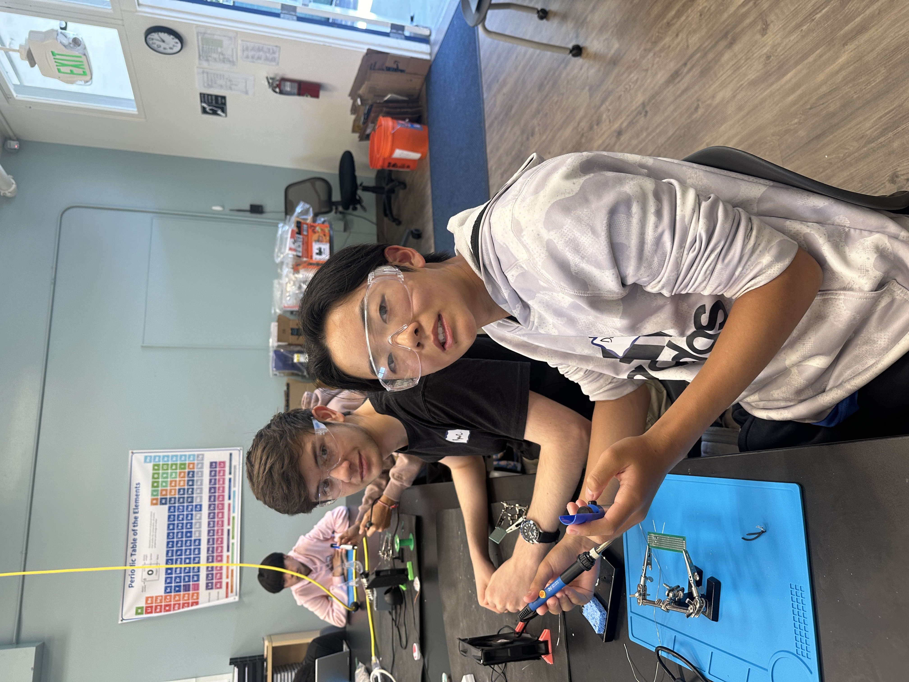
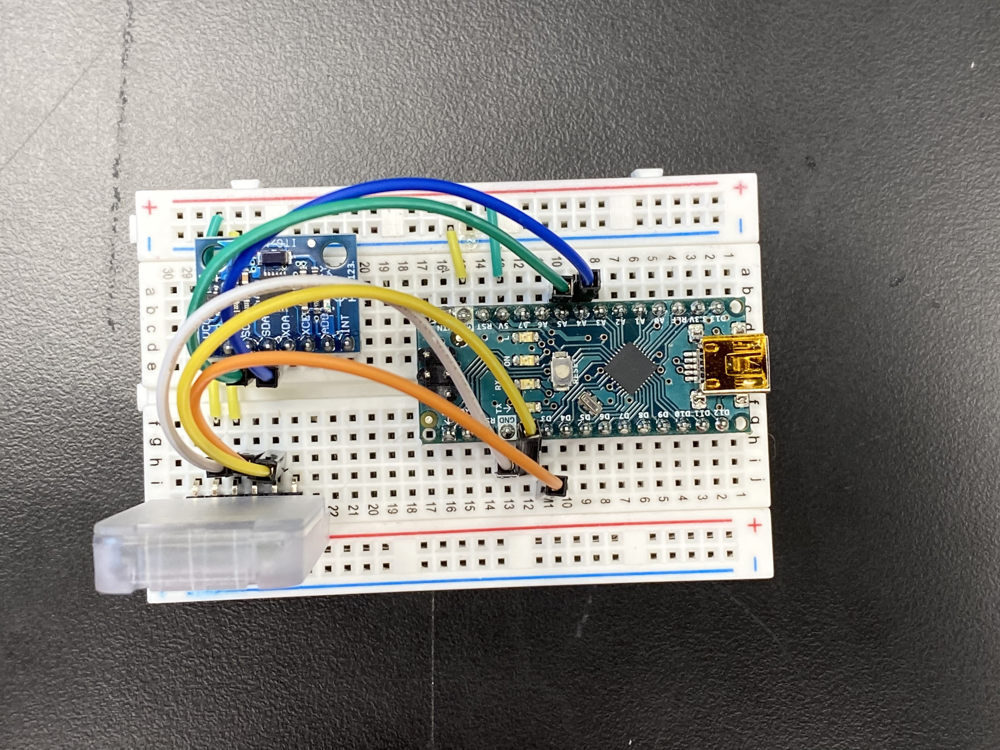

# 🤖 Gesture Controlled Robot 🤖
My project is a robot controlled by gestures from a bluetooth-connected gauntlet, that moves based on specific movements and directions, such as rotation and forward and backwards movement. One challenge I had was soldering the the pins so that some of them were connected (like the USB port) and some of them were seperate (like the pins on the LED display boards). My biggest takeaway from the project was to solder more carefully and precisely when the pins are pushed fully through, and to bend the pins to keep the pins fully pushed through.

| **Engineer** | **School** | **Area of Interest** | **Grade** |
|:--:|:--:|:--:|:--:|
| Daniel J. | Carlmont High School | Mechanical Engineering | Incoming Junior

  

 

# Final Milestone: 6/24/24

<iframe width="560" height="315" src="https://www.youtube.com/embed/4He3Q5KjJpA?si=w6uD7RK8z6YsOl8N" title="YouTube video player" frameborder="0" allow="accelerometer; autoplay; clipboard-write; encrypted-media; gyroscope; picture-in-picture; web-share" referrerpolicy="strict-origin-when-cross-origin" allowfullscreen style="border: 3px solid #c3ff00;"></iframe>

For my third milestone, I attached the top frame to the body of the robot, added a switch to the body, fixed the power disrepencies in the wheels, and started the concept for my glove. My biggest challenge at BSE was resolving an issue regarding an inconsistency in power: by focusing on specific areas that could be problematic, I removed the possibility for error in the motor and energy by changing the battery and constantly checking the voltage. Another issue was pairng to Arduinos together via HC-05 bluetooth modules, and we fixed that by troubleshooting very rigorously. Key topics I have learned in this process include soldering, isolating issues in an engineering process, and how voltage and current function using Ohm's Law. I hope to learn how to analyze code and interpret it into hardware-based actions. 

  
   
  <small>Figure 1: An image of the basic, completed breadboard that communicates basic movemements to the slave bluetooth module.</small>

# Second Milestone: 6/20/24

<iframe width="560" height="315" src="https://www.youtube.com/embed/jv5230nLu1c?si=5IgLsPRPFiSzR8Pm" title="YouTube video player" frameborder="0" allow="accelerometer; autoplay; clipboard-write; encrypted-media; gyroscope; picture-in-picture; web-share" referrerpolicy="strict-origin-when-cross-origin" allowfullscreen style="border: 3px solid #c3ff00;"></iframe>

For my second milestone, I implemented a bluetooth module that is paired with the main body to take inputs and translate them into motor actions. The bluetooth takes inputs from the accelerometer and gyroscope, being processed by the Arduino Nano R3 on the master module. The accelerometer and gyroscope measures "AcX"(yaw), "AxY"(pitch), and "AcZ"(roll). Each output of the master bluetooth module is read and checked with a series of conditions in which it communicates with the slave bluetooth module via sending letters. Then, the information is transferred (via Bluetooth) into the "slave" bluetooth module in order to be processed by an Arduino UNO and then outputted by an L298 motor controller with DC motors. What has surprised me the most was comprehensibility of the input process on the hand-mounted bluetooth module, where the data is printed in the Arduino IDE module. A previous challenge I overcame was the bluetooth connection process: it was surprisingly complex and took a long time to troubleshoot through. Before completing the final milestone, I will fix the consistency of power outage within the motors, as well as fix the battery output so that I do not have to use the power of my computer to power the motors. 

# First Milestone: 6/18/24

<iframe width="560" height="315" src="https://www.youtube.com/embed/eNRlPnJSBbU?si=I9Fve0eyifgYlNAW" title="YouTube video player" frameborder="0" allow="accelerometer; autoplay; clipboard-write; encrypted-media; gyroscope; picture-in-picture; web-share" referrerpolicy="strict-origin-when-cross-origin" allowfullscreen style="border: 3px solid #c3ff00;"></iframe>

For my first milestone, I have created the main body of the machine, creating the backbone for bluetooth connection. All motors work in coordination with the code inputted into the Arduino, being transported into an L298N Motor Controller. All of this is being powered by a battery case with an On/Off switch. One challenge I ran into was providing enough power for the motors to run. As a result, I used my computer to power the motors when testing, and plan to substitute and test my battery, case, and wiring for further ease of use. 

# Schematics 

  

<html lang="en">
<head>
    <meta charset="UTF-8">
    <meta name="viewport" content="width=device-width, initial-scale=1.0">
    <title>My GitHub Pages Site</title>
    
</head>
<body>
    <h1>Code</h1>
    

        <pre>
<b>Arduino NANO code (controlling code)</b>
            <code>

#include <SoftwareSerial.h>
SoftwareSerial BT_Serial(3, 2); // RX, TX

//Assigning buttons to pins
#define button1 7
#define button2 12

#include <Wire.h> // I2C communication library

const int MPU = 0x68; // I2C address of the MPU6050 accelerometer
int16_t AcX, AcY, AcZ;

int flag=0;

//Bool definitions
bool AcX_in_range = true;
bool AcY_in_range = true;

void setup () {// put your setup code here, to run once

Serial.begin(9600); // start serial communication at 9600bps
BT_Serial.begin(9600); 

// Setting buttons to detecting pulling up of buttons
pinMode(button1, INPUT_PULLUP);
pinMode(button2, INPUT_PULLUP);

// Initialize interface to the MPU6050
Wire.begin();
Wire.beginTransmission(MPU);
Wire.write(0x6B);
Wire.write(0);
Wire.endTransmission(true);

delay(500); 
}

//defining variables for BT_Serial.write()
char forward_slow = 'f';
char forward_fast = 'F';
char backward_slow = 'b';
char backward_fast = 'B';
char left_stationary = 'l';
char left_circle = 'L';
char right_stationary = 'r';
char right_circle = 'R';
//mecanum wheel ctrls
char forward_left = '1';
char forward_right = '2';
char backward_left = '3';
char backward_right = '4';

// perpendicular left and right ctrls
char perpendicular_left = '5';
char perpendicular_right = '6';

void loop () {
Read_accelerometer(); // Read MPU6050 accelerometer

// Assigning variable to digitalread of two buttons
int button1_state = digitalRead(button1);
int button2_state = digitalRead(button2);

// Constantly keep booleans for AcX in check 
if(AcX > 80 && AcX < 100){(AcX_in_range = true);}
else{(AcX_in_range = false);}

// Constantly keep booleans for AcY in check 
if(AcY > 80 && AcY < 100){(AcY_in_range = true);}
else{(AcY_in_range = false);}

// flag value of 2 is used for the acceleration based on higher degree of turning (capital letters)
// non-capital letters are slower ; capital letters are faster
//FORWARD
if(AcX < 75 && AcX > 40 && flag == 0 && AcY_in_range == true){flag=1; BT_Serial.write(forward_slow);}
if(AcX < 40 && flag == 1 && AcY_in_range == true){(flag = 2);} 
if(AcX < 40 && flag == 2 && AcY_in_range == true){flag = 0; BT_Serial.write(forward_fast);}

//BACKWARD
if(AcX > 110 && AcX<150 && flag == 0 && AcY_in_range == true){flag = 1; BT_Serial.write(backward_slow);}
if(AcX > 150 && flag == 1 && AcY_in_range == true){(flag = 2);}
if(AcX > 150 && flag == 2 && AcY_in_range == true){flag = 0; BT_Serial.write(backward_fast);}

// 'l'/'L'
if(AcY < 60 && AcY > 30 && flag == 0 && AcX_in_range == true){flag = 1; BT_Serial.write(left_stationary); } // 'L' is turn left in a circle, 'l' is turn left in place
if(AcY < 30 && flag == 1 && AcX_in_range == true){(flag = 2);} 
if(AcY < 30 && flag == 2 && AcX_in_range == true){flag = 0; BT_Serial.write(left_circle);}

// 'r'/'R'
if(AcY>120 && AcY < 150 && flag == 0 && AcX_in_range == true){flag=1; BT_Serial.write(right_stationary);} // 'R' is turn right in a circle, 'r' us turn right in place
if(AcY > 150 && flag == 1 && AcX_in_range == true){(flag = 2);}
if(AcY > 150 && flag == 2 && AcX_in_range == true){flag = 0; BT_Serial.write(right_circle);}

//MECANUM WHEEL DIRECTIONS [head of the robot is the side of the UNO]

//forward + left 
if(AcX < 65 && AcY < 75 && flag == 0){flag = 1; BT_Serial.write(forward_left);}
 
//forward + right 
if(AcX < 65 && AcY > 100 && flag == 0){flag = 1; BT_Serial.write(forward_right);}

//backward + left
if(AcX > 100 && AcY < 70 && flag == 0){flag = 1; BT_Serial.write(backward_left);}

//backward + right
if(AcX > 105 && AcY > 105 && flag == 0){flag = 1; BT_Serial.write(backward_right);}

//perpendicular left and right with button inputs

if(button1_state == 0 && flag == 0){flag = 3; BT_Serial.write(perpendicular_left);}

if(button2_state == 0 && flag == 0){flag = 3; BT_Serial.write(perpendicular_right);}

if(AcX>80 && AcX<110 && AcY>70 && AcY<120 && flag==1 || flag == 2 || flag == 3 && (button1_state == 1 && button2_state == 1)){flag=0;
BT_Serial.write('s'); // makes it so everything above this overrides it if they conflict

}

delay(100);  
}

void Read_accelerometer(){
      // Read the accelerometer data
Wire.beginTransmission(MPU);
Wire.write(0x3B); // Start with register 0x3B (ACCEL_XOUT_H)
Wire.endTransmission(false);
Wire.requestFrom(MPU, 6, true); // Read 6 registers total, each axis value is stored in 2 registers

AcX = Wire.read() << 8 | Wire.read(); // X-axis value
AcY = Wire.read() << 8 | Wire.read(); // Y-axis value
AcZ = Wire.read() << 8 | Wire.read(); // Z-axis value

AcX = map(AcX, -17000, 17000, 0, 180);
AcY = map(AcY, -17000, 17000, 0, 180);
AcZ = map(AcZ, -17000, 17000, 0, 180);

Serial.print(AcX);
Serial.print("\t");
Serial.print(AcY);
Serial.print("\t");
Serial.println(AcZ); 
}

            </code>
        </pre>
    

</body>
</html>

<!---

# Bill of Materials &#40;Main Project&#41;

| **Part** | **Note** | **Price** | **Link** |
|:--:|:--:|:--:|:--:|
| Arduino UNO | Inputs code from Arduino IDE app | $25.81 | <a href="https://www.newark.com/arduino/a000066/dev-board-atmega328-arduino-uno/dp/78T1601?COM=ref_hackster&CMP=Hackster-NA-project-94b13d-Jun-24"> Link </a> |
| Arduino Nano R3 | Transports inputs in the hand-mounted bluetooth gauntlet | $23.23 | <a href="https://www.newark.com/arduino/a000005/dev-board-atmega328-arduino-nano/dp/13T9275"> Link </a> |
| Inertial Measurement Unit (IMU) (6 deg of freedom) | What the item is used for | $5.99 | <a href="https://www.amazon.com/dp/B008BOPN40/?tag=octopart00-20"> Link </a> |
| SparkFun Dual H-Bridge motor drivers L298 | Transports actions into the motors using code from the Arduino | $9.99 | <a href="https://www.amazon.com/Stepper-Controller-Arduino-Envistia-Mall/dp/B07NKJFTGM?source=ps-sl-shoppingads-lpcontext&ref_=fplfs&psc=1&smid=A1CV2ETGSPQEB3"> Link </a> |
| Solderless Breadboard Half Size | Connects the actions through bluetooth | $4.96 | <a href="https://www.amazon.com/Arduino-A000066-ARDUINO-UNO-R3/dp/B008GRTSV6/"> Link </a> |
| HC-05 Bluetooth Module | Provides Bluetooth connection between the car and arm gauntlet | $10.39 | <a href="https://www.amazon.com/HiLetgo-Wireless-Bluetooth-Transceiver-Arduino/dp/B071YJG8DR"> Link </a> |
| Male/Male Jumper Wires | Connects pins on the Solderless Breadboard | $2.10 | <a href="https://www.amazon.com/Arduino-A000066-ARDUINO-UNO-R3/dp/B008GRTSV6/"> Link </a> |
| Male/Female Jumper Wires | Connects wires in chassis elements | $4.11 | <a href="https://www.newark.com/adafruit/826/wire-gauge-28awg/dp/88W2802?COM=ref_hackster&CMP=Hackster-NA-project-94b13d-Jun-24"> Link </a> | 
| DC Motor, 12V | Rotates the wheels on the robot base based on code input | $14.99 | <a href="https://www.newark.com/multicomp/287-2520/dc-motor-with-180-1-gear-reducer/dp/52Y4441?COM=ref_hackster&CMP=Hackster-NA-project-94b13d-Jun-24"> Link </a> | 
| Pimoroni Maker Essentials - Micro-motors & Grippy Wheels | Wheels for the outputs of the motors to rotate and move | $33.57 | <a href="https://www.amazon.com/Arduino-A000066-ARDUINO-UNO-R3/dp/B008GRTSV6/"> Link </a> |
| Rocker Switch, SPST | Turns the base of the robot on and off | $4.53 | <a href="https://www.newark.com/mcm/is-ec-rs12513/switch-operation/dp/95Y1410?COM=ref_hackster&CMP=Hackster-NA-project-94b13d-Jun-24"> Link </a> |
| 9V Battery Clip | Connects the battery to the body of the robot | $0.54 | <a href="https://www.newark.com/keystone/233/battery-strap-9v-wire-lead/dp/22C4351?COM=ref_hackster&CMP=Hackster-NA-project-94b13d-Jun-24"> Link </a> |
| 9V Battery (generic) | Powers the body of the robot via the 9V battery clip | $10.99 | <a href="https://www.amazon.com/Arduino-A000066-ARDUINO-UNO-R3/dp/B008GRTSV6/"> Link </a> |
| Battery Holder, 18650 x 2 | Holds batteries to substitute as a power source | $9.48 | <a href="https://www.newark.com/keystone/1048/battery-holder-18650-li-ion-2cell/dp/56T2029?COM=ref_hackster&CMP=Hackster-NA-project-e96ead-Jun-24"> Link </a> |

| Item Name | What the item is used for | $Price | <a href="https://www.amazon.com/Arduino-A000066-ARDUINO-UNO-R3/dp/B008GRTSV6/"> Link </a> |
--->

# Other Resources/Examples
Here are some of the other resources, examples, and videos I used to create my final project.
- [How to connect “L298N Dual H-Bridge Motor Controller” to “Arduino Uno”](https://www.youtube.com/watch?v=OkHR1BZCcqA)
- [Arduino Based Gesture Controlled Robot Overview]([https://www.youtube.com/watch?v=wZurHScVyAM](https://marobotic.com/2023/12/08/arduino-based-hand-gesture-control-robot/))
- [Arduino Two Way Communication via Bluetooth](https://www.instructables.com/Arduino-Two-Way-Communication-Via-Bluetooth-HC-05/)
  

# Starter Milestone

<iframe width="560" height="315" src="https://www.youtube.com/embed/gqJXe-XYi_0?si=VRvozP0RvAkL96Hh" title="YouTube video player" frameborder="0" allow="accelerometer; autoplay; clipboard-write; encrypted-media; gyroscope; picture-in-picture; web-share" referrerpolicy="strict-origin-when-cross-origin" allowfullscreen style="border: 3px solid #ffff00;"></iframe>

For my starter project, I built a handy arcade box with four directional buttons, two side buttons with additional game settings including a firing function for specific games, stop start and pause, and a toggle for music. Also, a score counter and game display are all used neatly with LED display, and a switch and battery case are used to power the arcade machine.

# Bill of Materials &#40;Starter Project&#41;
<!--- Here's where you'll list the parts in your project. To add more rows, just copy and paste the example rows below.
Don't forget to place the link of where to buy each component inside the quotation marks in the corresponding row after href =. Follow the guide [here]([url](https://www.markdownguide.org/extended-syntax/)) to learn how to customize this to your project needs. -->
<a href="https://www.amazon.com/Electronic-Soldering-Practice-Comfortable-VOGURTIME/dp/B094QRRHC2/ref=sr_1_3?crid=12C0SOV36FG6M&dib=eyJ2IjoiMSJ9.Prj06eg0mzBHrfW8zuFr43Ott4t2wUOVBo8A8bYw0PqFZRlOEmgR5YwhMy7jXrdI2HlBjVttnEyYLz5CP684SzJyHmVMBp25vNna9o8wjV-df55ilTgj0xMy1CiRwkcnu6xqacZ3JUPlq8C3mQJwmEtoeokndNqpwpdkZBQMplM9vg3M-cfB0xM_nXdjeqHQ3bB707ehrzX6Llp-Euu3CTFzF8wgEqhPwo6RCvzbo5M.yyrFg8EXJr9BL5cOgZF551-8cIl91p0MSy8nGiilcpU&dib_tag=se&keywords=arcade%2Bsolder%2Bproject&qid=1717994267&sprefix=arcade%2Bsolder%2Bprojec%2Caps%2C147&sr=8-3&th=1">Amazon Calculator Link</a>

| **Part** | **Note** | **Quantity** |
|:--:|:--:|:--:|:--:|
| Solderless breadboard | Main frame for the build | x1 |
| LED display board | Displays the various games | x2 |
| 5V USB power cable | Possible external modifications to code / debugging | x1 |
| Battery Case | Powers the project | x1 |
| Functional buttons | Controls in-game direction, music, firing, etc | x7 |
| LED score board | Displays current score for each game | x1 |
| Rectangular transparent  frame | Used between the frame to hold the game | x2 |
| Side transparent frame | Pins the two rectangular frames together | x4 | 

